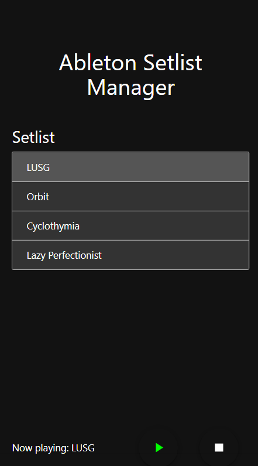

# Ableton Setlist Management Project

## Overview

This project is a web-based application for managing setlists in Ableton Live using the AbletonOSC protocol. It provides a Flask backend that communicates with Ableton Live to retrieve cue points, control playback, and monitor the playhead position.

## Features

- **Cue Points Retrieval**: Fetches cue points from the current Ableton Live set.
- **Playback Control**: Allows users to play songs from specific cue points and stop playback at designated points.
- **Playhead Monitoring**: Continuously monitors the current playback position and stops playback when reaching a specified stop position.

## Technologies Used

- **Python**: Backend logic and OSC communication.
- **Flask**: Web framework for creating the API.
- **HTML/CSS/JS**: Frontend for user interaction.
- **AbletonOSC**: OSC protocol for communication with Ableton Live.

## Installation

### Prerequisites

- Python 3.x
- pip (Python package installer)

### Steps

1. Clone the repository:

   ```bash
   git clone <repository-url>
   cd <repository-directory>
   ```

2. Install required packages:

   ```bash
   pip install flask python-osc
   ```

3. Run the application:

   ```bash
   python app.py --hostname <ableton-ip> --port <ableton-port>
   ```

   Replace `<ableton-ip>` with the IP address of the machine running Ableton Live and `<ableton-port>` with the OSC port (default is 11000).

4. Open a web browser and navigate to `http://localhost:5000` to access the application.

## API Endpoints

- **GET `/get_cue_points`**: Retrieves the list of cue points from the current Ableton Live set.

- **POST `/play_song`**: Starts playback from a specified cue point.
  - Request Body:
    ```json
    {
      "cue_index": <index>,
      "cue_points": [[<cue_name>, <cue_position>], ...]
    }
    ```

- **POST `/monitor_playhead`**: Monitors the current position and stops playback when reaching the specified stop position.
  - Request Body:
    ```json
    {
      "stop_pos": <position>
    }
    ```

- **POST `/stop_song`**: Stops the currently playing song.

## Usage

1. **Retrieve Cue Points**: Click a button on the frontend to fetch cue points.
2. **Play a Song**: Select a cue point and initiate playback.
3. **Monitor Playback**: The application will automatically stop playback when the specified stop position is reached.

## Gen 1 user interface

--
